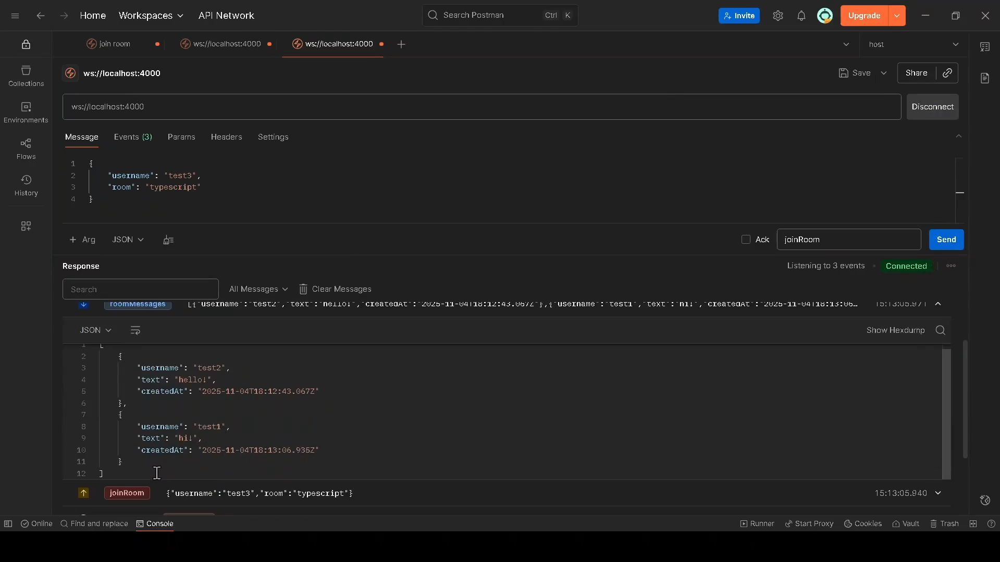
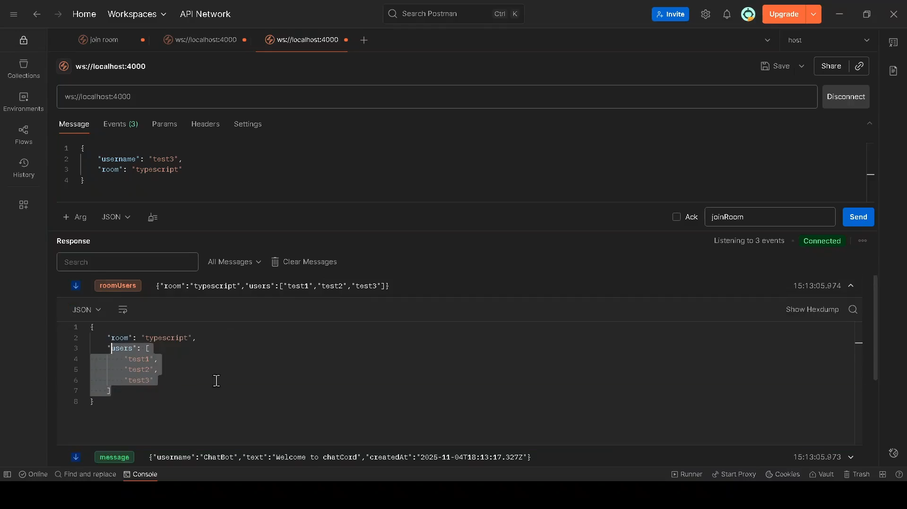

### About this project:

Project developed with the following technologies:

- TypeScript
- Nodejs
- Expressjs
- MongoDB
- Redis
- WebSockets.

This is a chat application where users can chat with other users in real time if they are in the same room.

## Testing the project:

You will need to install the docker images at docker-compose.yml.

Start the project with npm run start:dev or npm run start.

Pick a room and enter an username

Open two or more tabs on your favorite testing software. Join the same room you joined on the first tab, on the second tab.

Then send some test messages in both the first and second tabs. You will see only they can see these messages, users from different room cannot see it.

What you should see after users send some messages:

You can also see the users in the room currently:

## Versioning

1.0.0.0

## Author

Rubemar Rocha de Souza Junior (https://github.com/rubemarjrtech) In case of sensitive bugs like security vulnerabilities, please contact rubemarrocha22@gmail.com directly instead of using issue tracker.
